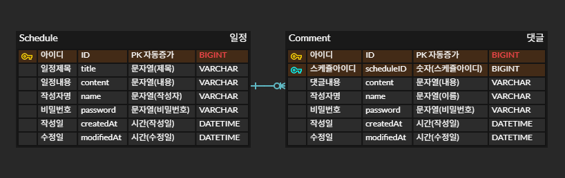

## 📅 일정관리 앱

Spring Boot와 JPA를 활용하여 구현한 일정 관리 REST API 프로젝트입니다

일정(Schedule)과 댓글(Comment) 기능을 제공하며, 

3 Layer Architecture 기반으로 설계되었습니다

## 📌 프로젝트 소개
Spring Boot와 JPA를 활용하여 구현한 일정 관리 REST API 프로젝트입니다

일정(Schedule)과 댓글(Comment) 기능을 제공하며,

일정 생성, 조회, 수정, 삭제 및 댓글 기능을 포함하고 있습니다

3 Layer Architecture를 적용하여 Controller, Service, Repository의 역할을 분리하고,

DTO를 활용하여 API 응답 구조를 설계했습니다

## ⚙️ 기능
### 📅 일정 기능 (Schedule)
- 일정 생성
- 전체 일정 조회 (작성자명 조건 조회 가능)
- 단건 일정 조회 (댓글 포함)
- 일정 수정 (비밀번호 검증)
- 일정 삭제 (비밀번호 검증)
### 💬 댓글 기능 (Comment)
- 댓글 생성
- 일정 단건 조회 시 댓글 함께 조회
- 일정당 댓글 최대 10개 제한
## 🛠 기술 스택
- Java 17
- Spring Boot
- Spring Data JPA
- MySQL
- Gradle

## 📊 ERD

하나의 일정(Schedule)에는 여러 개의 댓글(Comment)이 달릴 수 있다

1:N 관계 (일정 1개 : 댓글 여러 개) 구조이다

댓글은 특정 일정에 종속되며, scheduleID를 통해 어떤 일정에 속하는지 식별한다

## 📡 API 명세

포스트맨을 이용해 작성한 API 일정관리

👉 [Postman API 문서 바로가기](https://documenter.getpostman.com/view/53912059/2sBXitBn5S)

## 📂 구조

controller/
- ScheduleController
- CommentController

service/
- ScheduleService
- CommentService

repository/
- ScheduleRepository
- CommentRepository

entity/
- Schedule
- Comment

dto/
- request / response DTO

## 💡 구현 과정
### Step 1 (일정 생성 구현)
- Schedule 엔티티 설계
- 작성일, 수정일 필드는 JPA Auditing을 활용하여 적용 (생성시 동일)
- ID 는 자동생성

#### Step 2 (일정 조회 구현)
- 전체 조회 시 작성자명 조건 조회 추가
- 수정일 기준 내림차순 정렬 적용
- 단건 조회시, 유저 ID 사용

#### Step 3 (일정 수정 구현)
- 일정수정시, Request DTO 로 비밀번호 요청
- 비밀번호 확인 로직 추가
- 수정시간 수정기준으로 업데이트

#### Step 4 (일정 삭제 구현) 
- 비밀번호 요청후 확인로직 구현

#### Challenge 1(댓글 생성 구현)
- 댓글은 일정의 ID 를 토대로 생성
- Count 쿼리로 일정당 10개의 댓글 제한

#### Challenge 2(조회 기능 확장)
- 일정 단건 조회 DTO 변경
- Response DTO 에 댓글 리스트포함

#### Challenge 3(입력 검증 수정)
- 입력값에 필수값,글자수제한 처리

## 🔥 트러블슈팅
1. JPA 메서드 네이밍 오류

CamelCase를 적용하지 않아 쿼리 생성 실패

👉 엔티티 필드명 기준으로 정확히 작성
2. 비밀번호 검증 로직 오류

요청값과 자기 자신을 비교하는 실수 발생

👉DB에 저장된 값과 비교하도록 수정
3. Service 설계 고민

ScheduleService에서 CommentRepository 사용 여부 고민

👉일정 상세 조회를 완성하기 위한 책임으로 판단하여 사용
4. 댓글 제한 구현 방식 고민

DB에서 제한할지 Service에서 처리할지 고민

👉count 조회 후 Service에서 제한

## ✨ 느낀점

이번 프로젝트를 통해 단순 CRUD 구현을 넘어,

Spring 기반의 3계층 구조와 객체지향 설계의 중요성을 이해할 수 있었습니다.

Service 계층에서 비즈니스 로직을 처리하면서 코드의 흐름이 명확해졌고,

DTO를 통해 Entity와 API 응답을 분리하는 설계 방식을 경험할 수 있었습니다

비밀번호 검증과 같은 비즈니스 로직을 직접 구현하면서,

검증 로직의 중요성을 경험할 수 있었습니다